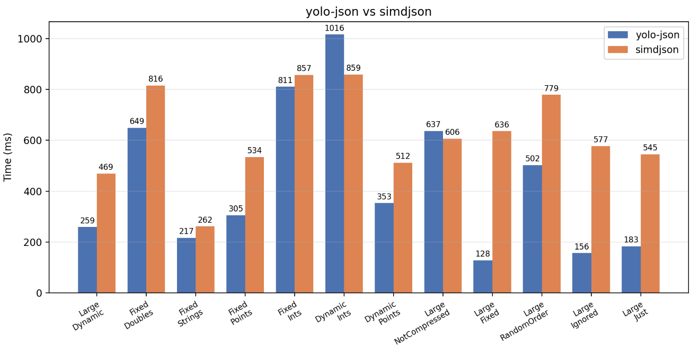

# yolo-json


A **header-only, reflection-driven JSON parser for C++26**. 

Field-to-key mapping, ordering, skipping, sizing, and display names are all  expressed as **compile-time annotations** on the struct and its members. This allows to embed knownledge about incoming JSON for better performance.

Current implementation beats the [simdjson](https://github.com/simdjson/simdjson) by performance. Please, see the [article](https://habr.com/ru/articles/1076274/) devoted to the framework (article in Russian).

The project is under active development. Contributions are welcome.
* * *

## Features

- Nested objects, `std::tuple` / `std::pair`, and containers  
    (`std::array`, `std::vector`, `std::deque`).
- `Ignore` / `Size` / `MinSize` / `StaticSize` value-shaping hints.
- Whitespace-tolerant parsing via `NotCompressed`.
- Key-based (order-independent) parsing via `RandomOrder`.
- `std::string_view` fields/values that point directly into the input buffer  
    (zero copy).

## Requirements

A cpp compiler with -freflection capability. For instance, GCC 16.1 and higher.

## Building

```sh
# Clone with the utxx submodule
git clone --recurse-submodules git@github.com:<your>/yolo-json.git
cd yolo-json

# Configure (first time; may fetch GoogleTest over SSH)
cmake -S . -B build

# Build
cmake --build build

# Install
cmake --install build --prefix /your/prefix
```

Make sure your build has the cpp flags `-freflection -std=c++26`.

```sh
cmake -S . -B build -DBUILD_TESTS=ON
cmake --build build
ctest --test-dir build --output-on-failure
```

### Install (header-only)

```sh
cmake --install build --prefix /your/prefix
```

Headers land under `include/yolo-json/`, so downstream code includes them as:

```cpp
#include <yolo-json/parser.hpp>
```

## Basic usage

Define a struct and annotate it, then call `yjson::ParseJson` with a pointer to  
the opening `{` and a one-past-the-end pointer:

```cpp
#include <yolo-json/parser.hpp>

#include <cstring>
#include <iostream>
#include <optional>
#include <string>

struct[[= yjson::NotCompressed{}]] Person
{
  std::string name;
  int age;
  [[= yjson::MayAbsent{}]] std::optional<std::string> email;
};

int main()
{
  char json[] = R"({ "name" : "Ada" , "age" : 36 , "email" : "ada@example.org" })";

  auto [rest, person] = yjson::ParseJson<^^Person>(
      json, json + std::strlen(json));

  std::cout << person.name << " is " << person.age << '\n';
  // rest points just past the closing '}'
}
```

`ParseJson` returns a `std::pair<char*, T>`: the first element is the pointer  
just past the parsed value, the second is the populated struct. It parses the  
buffer **in place**, so the input must be mutable and, if you use  
`std::string_view` fields, must outlive the result.

By default, fields are expected in struct declaration order and the JSON is  
assumed to be tightly packed. Add `NotCompressed` to tolerate whitespace, and  
use `Position` / `Alphabetical` to change field order:

```cpp
struct[[= yjson::Alphabetical{false}]] Fruit
{
  int banana;
  int apple;
  int cherry;
};
// expects: {"apple":1,"banana":2,"cherry":3}
```

Nested objects, tuples, and containers are parsed recursively:

```cpp
struct[[= yjson::RandomOrder{}]] Basket
{
  std::vector<std::string> tags;
  std::tuple<int, int> dims;
  Fruit fruit;              // nested object
  int count;
};
```

### Annotation reference

**Struct-level** (applied as `struct[[= yjson::X{}]] Name { ... };`):

| Annotation | Effect |
| --- | --- |
| `Alphabetical{_Rev}` | Sort fields alphabetically (case-insensitive); `_Rev=true` reverses. |
| `NotCompressed{}` | Tolerate whitespace/newlines between tokens. |
| `RandomOrder{}` | Match fields by key, in any order. |

**Field-level** (applied as `[[= yjson::X{...}]] int field;`):

| Annotation | Effect |
| --- | --- |
| `Position{n}` | Pin the field to parse slot `n`. |
| `Size{n}` | Fixed width of the value in the JSON (used to skip it). |
| `MinSize{n}` | Minimum width hint for the value. |
| `StaticSize{n}` | Exact number of container elements (fully unrolls parsing). |
| `Ignore{}` | Skip the value; the member keeps its default-initialized value. |
| `MayAbsent{}` | Field may be missing; requires `std::optional`. |
| `DisplayName{"..."}` | Override the JSON key name. |

Multiple field annotations can be combined:

```cpp
[[ = yjson::Position{0}, = yjson::MayAbsent{}, = yjson::DisplayName{"id"} ]]
std::optional<int> user_id;
```

## Supported types

- Scalars: integral types, floating-point types, `bool`, `std::string`,  
    `std::string_view`.
- `std::optional<T>` (including `null` and, with `MayAbsent`, missing keys).
- `std::tuple` and `std::pair` (parsed from JSON arrays).
- Containers detected via `begin`/`end` + `push_back`/`push`, plus  
    `std::array`.
- Nested annotated structs.

## Known limitations

- The `Ignore` + `Size` fast path and the `IsContainer`  
    `static_assert(false)` branch in `parser.hpp` are experimental/unimplemented.
- Raw arrays are not supported.
- Redundant or contradicting annotations are not checked.
- See the Issues tab for more known problems and plans (contributions are welcome).

## Project layout

```
Include/            Library headers (namespace yjson)
  parser.hpp        Reflection parser: ParseJson, ParseBase, GetOrderedField
  json_parser.hpp   Low-level JSON scanning (JSONParser namespace)
  utils.hpp         Annotations, StructAnnots/FieldAnnots, type traits
test/               GoogleTest tests (BUILD_TESTS=ON)
benchmark/          simdjson comparison benchmark (BUILD_BENCH=ON)
utxx/               git submodule dependency
```

## Benchmark
The following is the benchmark with simdjson framework. Results are replicable with the `-DBUILD_BENCH=ON` cmake configuration. Graph reflects time for 1 Gb of JSON parcing.


## License

See [LICENSE](resources/b344569218c742099739a14e93d5c25e.bin).
